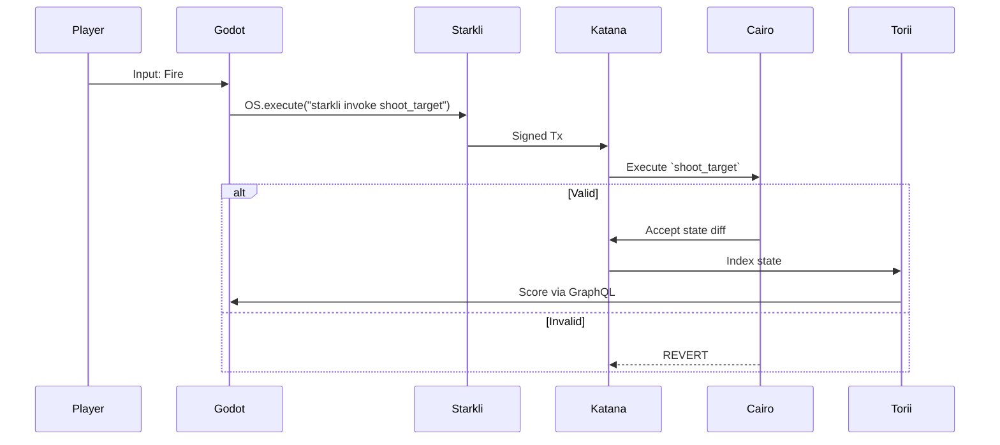

# ZK‑Sniper / Obsidian Anti‑Cheat

   

> **Non‑invasive ZK anti‑cheat for FPS games — move critical game rules on‑chain.**

**Prize:** 🏆 Second Place — HackPrix Buildwith Hackathon

---

## What this project solves

Modern anti‑cheat systems often require deep OS access (kernel‑level drivers) that invade user privacy and are still bypassed by hardware cheats. **ZK‑Sniper** (aka *Obsidian Anti‑Cheat*) avoids invasive monitoring by making the game’s core rules verifiable on a Starknet Layer‑2 using Cairo smart contracts.

**Key idea:** Every important action (movement, shot, damage) becomes a cryptographically verifiable transaction. If an action violates the on‑chain physics or rules, the contract reverts the transaction and the state update never occurs.

---

## Highlights

* No kernel drivers or file scanning — privacy preserved.
* Game physics, damage, and scoring enforced as immutable Cairo contracts.
* Local execution with `katana --dev` and `starkli` provides trustless, auditable verification.
* Torii indexer syncs on‑chain state to Godot for real‑time UI.

---

## How it works (short)

1. Player input in Godot triggers a `Proof of Action` (shot/movement payload).
2. The client or local relay signs and submits a transaction (`starkli invoke` or `server.py`).
3. Katana executes the Cairo contract which asserts game invariants (e.g. `speed < 10`, `recoil > 0`).
4. Valid tx → state update and Torii indexes the new score. Invalid tx → **REVERT**.
5. Godot polls Torii (GraphQL) and updates the scoreboard.

---

## Architecture

* **Godot 4.x** — game client and local UI.
* **Katana (devnet)** — local sequencer / executor for Cairo systems.
* **Cairo Contracts** — immutable game rules & player models (deployed via `sozo`).
* **Starkli CLI / Python Relay (`server.py`)** — signs and submits player transactions.
* **Torii Indexer** — indexes world state and exposes a GraphQL endpoint to Godot.

---

## Components & Status

| Component           |            Role | Notes                                             |
| ------------------- | --------------: | ------------------------------------------------- |
| Katana              | local sequencer | RPC: `127.0.0.1:5050`                             |
| Cairo systems       |      game rules | deploy with `sozo build && sozo migrate`          |
| starkli / server.py |    signer/relay | `starkli` invoked by Godot or `python3 server.py` |
| Torii               |         indexer | `torii --world <WORLD_ADDRESS>`                   |

---

## Execution flow (sequence)



---

## Quickstart (WSL)

> Run each command in its own terminal tab (order matters):

**Tab 1 — Katana**

```bash
katana --dev
# RPC available at 127.0.0.1:5050
```

**Tab 2 — Deploy Cairo systems**

```bash
sozo build && sozo migrate
# Capture WORLD_ADDRESS from migration output
```

**Tab 3 — Torii indexer**

```bash
torii --world 0xWORLD_ADDRESS
```

**Tab 4 — Relay (optional)**

```bash
python3 server.py  # runs on 0.0.0.0:3000
```

**Godot (frontend)**

* Open project in Godot 4.x
* Initialize player entity (Spawn action — default `P`)
* Run and test: Left‑click to shoot. Look for: `BLOCKCHAIN VERIFIED: Tx Success.` in output.

---

## Notes & best practices

* Keep private keys local. `starkli` or the relay must sign from a secure environment variable or keystore.
* Design contracts with clear, minimal assertions to avoid false positives.
* Use Torii GraphQL polling (1s) for near‑real‑time scoreboard updates in Godot.


---

## License

MIT

---

## Contributors

Team Obsidian — HackPrix Buildwith Hackathon

---


